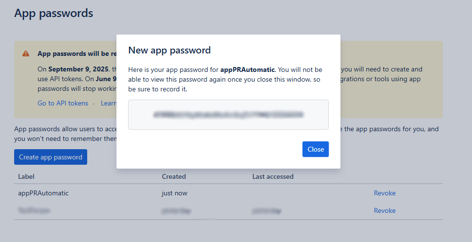

# README -- Generador de Pull Request automatizado

## Descripción
Este proyecto está desarrollado para genera Pull Request de manera automática y masiva. Esto enfocado principalmente a migración con gran cantidad de componentes.

## Configuración genérical del proyecto

Para realizar la configuración del proyecto Se debe tener tanto el usuario y la clave para lograr la comunicación con la api de Bitbucket.

1- Para obtener el username, se tiene que acceder a, ingresando a [settings -> Account settings](https://bitbucket.org/account/settings/).
2- En la sección "Bitbucket profile setting", se puede apreciar el campo "Username"  (Como se muestra en la imagen a continuación).
    

3- Para obtener la clave para realizar la conexión por medio de la api se tiene que acceder a [settings -> App passwords](https://bitbucket.org/account/settings/app-passwords/). En esta sección se tiene que presionar el botón "Create app password"

4- Luego de presionar el botón aparece un formulario en donde se tiene que ingresar el nombre de la clave, y se deberá escoger los permisos asociados.

Como se aprecia en la imagen, solo damos permisos para escribir pull requests. Después presionamos el botón "Create".

5- Se levantará un modal en donde se puede apreciar la clave a utilizar.

6- Una vez obtenida esta información se tiene que dejar esta información en el archivo [.env](.env), en donde se tiene que pegar el username y el password app, obtenida anteriormente
    
    USER={username}
    PASSWORD={appPassword}
    

## Formas de ejecución

Este ejecutador tiene dos formas de ejecución, las cuales son las siguientes:

1- La primera opción de ejecución corresponde a la generación de PR individual, la cual se tiene que ejecutar con el siguiente comando.

    py PrBitbucket_individual.py {workspace} {repo_slug} {branch_origin} {branch_destination}

2- La segunda opción corresponde a la ejecución masiva de los PR, la cual se ejecutan con el siguiente comando:

    py PrBitbucket_Massive.py

Esta ejecución obtiene la información a ejecutar desde el archivo [pullRequest.txt](pullRequest.txt). En el cual se tiene que registrar el workspace, repo_slug, branch_origin, branch_destination; esto separado con una coma. Como se muesta a continuación

    {workspace},{repo_slug},{branch_origin},{branch_destination}

3- La respuesta varía dependiendo de la forma de ejecutar el proyecto. En el caso de ejecutar el flujo individual, el resultado de la ejecución aparecerá por pantalla.

Por otro lado, en el caso de ejecutar de manera masiva sé generar un archivo (result.txt), el cual contendrá el resultado de cada uno de PR solicitados.

El archivo de salida del masivo tiene el siguiente formato

    {workspace}/{repo_slug}/{branch_origin}/{branch_destination} -- AutomaticPullRequest{yyyyMMdd}_{HHMMSS}_{branchSource}To{branchDestination} -- {URL_PR} -- {MessageError} 

La respuesta está formada por los siguientes campos:

    1. PR que se solicitó ejecutar
    2. Nombre del PR que se generó.
    3. Url del Pull Request generado.
    4. Mensaje de error.

Todos separados por "--". En el caso de que el proceso haya generado un PR, se omite el 4° campo. En caso contrario, se omiten los campos 2° y 3°; y se deja mensaje en 4° campo.